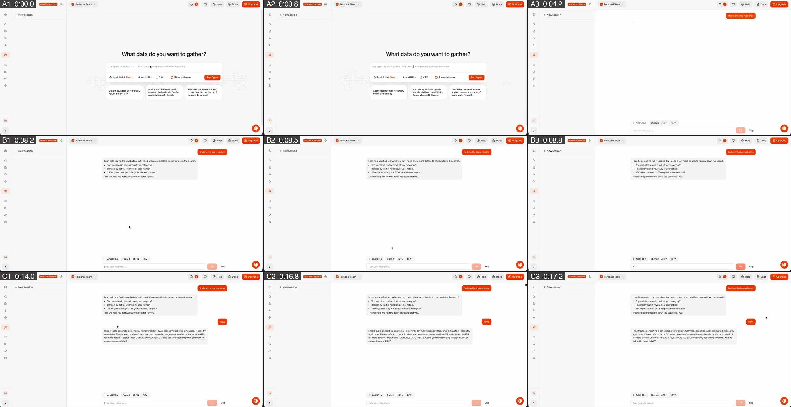
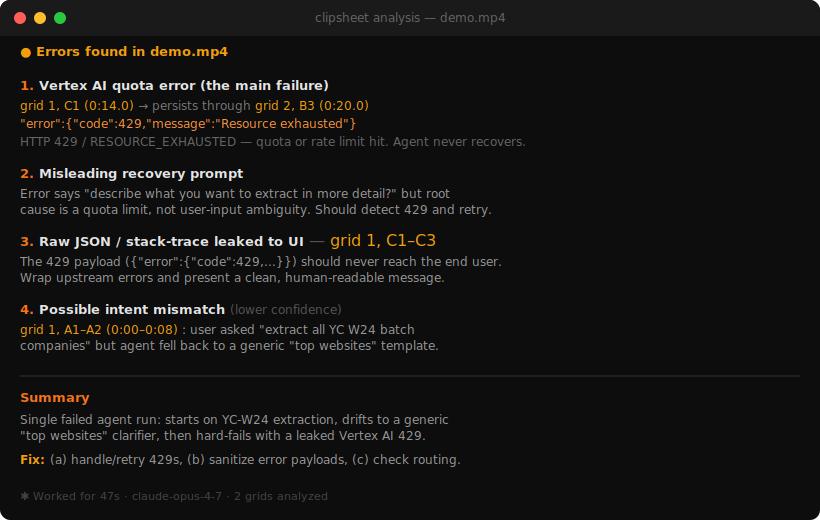
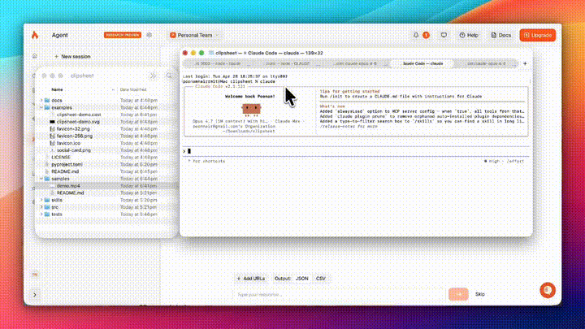

<p align="center">
  
</p>

# clipsheet

> **Turn any video into images your AI agent can read.**

Playwright, browser-use, multimodal LLM video analysis, and native video APIs are slow — often minutes per run, expensive, and overkill when you just need to see what happened on screen. clipsheet converts any video into a handful of annotated grid images that any vision-capable model can read in one pass. Record a screen, drop in a clip, hand it a product demo — if it's a video, clipsheet can process it.

[](https://pypi.org/project/clipsheet/)
[](https://pypi.org/project/clipsheet/)
[](LICENSE)





Any video → 2-4 grid images → one model call. Process multiple videos at once. CPU-only, no GPU, no audio, no API keys. Best for videos under 5 minutes — beyond that, consider [Gemini native video](https://ai.google.dev/gemini-api/docs/video) or [Twelve Labs](https://twelvelabs.io).

---

## Why clipsheet?

| Approach | Time for a 2-min recording | Cost | What the agent sees |
|---|---|---|---|
| **Playwright / browser-use** | 2+ minutes (real-time) | Compute + browser | Screenshots you scripted |
| **Gemini native video** | 30-60s upload + processing | ~$0.02-0.10/min video | Every frame (slow, expensive) |
| **Any video + clipsheet** | 1-2 seconds processing | Free (CPU-only) | Deduplicated keyframes with timestamps |

---

## 30-second start

```bash
pip install clipsheet
clipsheet recording.mp4
```

Output lands in `recording_clips/` next to your video:

```
recording_clips/
  grid_01.jpg       3×3 mosaic, cells labeled A1..C3, timestamps burned in
  grid_02.jpg       next 9 frames in time order
  manifest.json     maps each cell back to its source timestamp
```



---

## Use it from your coding agent

### Install the skill (one time)

```bash
clipsheet init
```

This auto-detects every coding agent on your machine — Claude Code, Cursor, Codex, Gemini CLI, Copilot, Windsurf, Aider, Goose — and writes the skill into each one's directory.

### Then just talk to your agent

**Claude Code:**
```
> /clipsheet review this video for bugs: ~/Downloads/bug-repro.mp4
> /clipsheet what errors do you see in these two recordings: flow1.mp4 flow2.mp4
```

**Cursor:**
```
> /clipsheet debug this flow: recording.mp4
```

**Codex CLI:**
```
> $clipsheet what UI states appear in this recording: session.mp4
```

**Any agent with shell access** (no skill needed):
```
> run clipsheet on recording.mp4 and tell me what went wrong
```

### Real-world examples

**Debug agentic applications — see how users interact with your agent's UI:**
```
> /clipsheet ~/Downloads/agent-session.mp4
> the chat layer is clashing with the sidebar — what's happening at each step?
```

**Review short-form content — get feedback on hooks, pacing, and visual elements:**
```
> /clipsheet ~/Desktop/reel-draft.mp4
> rate the hook, suggest a better opening, and write the transcript
```

**Debug web animations and 3D components:**
```
> /clipsheet ~/Desktop/animation-bug.mov
> the CSS transition is janky between 0:03 and 0:05 — what's the state at each frame?
```

**Compare working vs broken flows:**
```
> /clipsheet ~/Desktop/checkout-working.mov ~/Desktop/checkout-broken.mov
> what's different between these two?
```

**Batch-review multiple recordings:**
```
> /clipsheet bug1.mp4 bug2.mp4 bug3.mp4
> list every issue you see across all three
```

---

## CLI reference

### Process videos

```bash
clipsheet <video> [video2 ...] [options]
```

| Option                  | Default | Description                                                |
|-------------------------|---------|------------------------------------------------------------|
| `-o, --output <dir>`    | `<video>_clips/` | Output directory. Auto-created next to each input. Override with `-o` or `CLIPSHEET_OUTPUT_DIR` env var. |
| `--grid <RxC>`          | `3x3`   | Cell layout. `2x3` for larger/more readable cells, `4x4` for dense recordings. |
| `--max-grids <n>`       | `4`     | Cap on grid images. Bump for videos > 8 minutes.           |
| `--fps <n>`             | `4`     | Sample rate in fps. Higher values catch more transitions but take longer. |
| `--keep-intermediate`   | `false` | Keep `_raw/` and `_cells/` for debugging.                  |
| `--json`                | `false` | Emit a JSON summary on stdout (for piping to `jq`).        |
| `--pretty`              | `false` | Pretty-print JSON (only with `--json`).                    |
| `-v, --verbose`         | `false` | Show sampling details and frame counts.                    |

Examples:

```bash
clipsheet recording.mp4                          # output → recording_clips/
clipsheet bug1.mp4 bug2.mp4 bug3.mp4             # process multiple videos
clipsheet bug1.mp4 bug2.mp4 -o ./all-bugs        # all outputs into one directory
clipsheet recording.mp4 --grid 2x3               # larger cells for readable text
clipsheet animation-bug.mp4 --fps 8              # catch fast UI transitions
```

### Other commands

```bash
clipsheet init                    # install skill into detected agents
clipsheet init --agent <name>     # scope to specific agents (repeatable)
clipsheet init --force            # overwrite existing skill installs

clipsheet --status                # version, ffmpeg, agents, recent runs
clipsheet --version               # short version string
clipsheet --help                  # full help
```

---

## Install

```bash
pip install clipsheet
# or: uv tool install clipsheet
# or: pipx install clipsheet
```

ffmpeg is bundled. No separate install needed.

---

## What it does NOT do

- **No audio transcription.** Use Whisper if you need the soundtrack.
- **No video editing, trimming, or transcoding.** Different tool category.
- **No GPU.** CPU-only by design, for portability.

Works on any video format ffmpeg can read — MP4, MOV, HEVC, WebM, MKV, AVI, and more. When *not* to use clipsheet: if you need frame-by-frame motion analysis, audio understanding, or real-time video streaming, use Gemini 2.5 native video or Twelve Labs.

## Performance

clipsheet processing times on a 2024 M-series Mac (CPU only):

| Video                    | Duration | Grids | clipsheet |
|--------------------------|----------|-------|-----------|
| Agent UI screen recording | 21s      | 2     | <1s       |
| Product demo              | 41s      | 4     | ~2s       |
| Product demo              | 58s      | 4     | ~1s       |
| YouTube video (1080p)     | 69s      | 4     | ~1s       |
| Presentation              | 2 min    | 2     | ~2s       |
| Presentation              | 3.3 min  | 4     | ~11s      |
| Screen recording (HEVC)   | 4.9 min  | 4     | ~14s      |

**Where does the time go?** clipsheet itself is fast — under 2 seconds for most videos under 2 minutes. When using it through an agent (Claude, Gemini, etc.), most of the wait is the model reading the grid images and generating a response, not clipsheet processing. A typical loop: ~1s clipsheet + ~5s image reading + ~10s response = ~15-20s total.

Requires macOS 10.15+, Linux, or Windows 10+. Python 3.10+.

## License

MIT. See [LICENSE](LICENSE).
